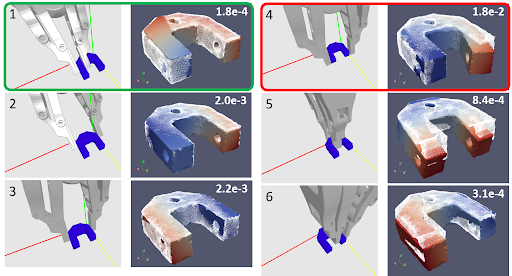
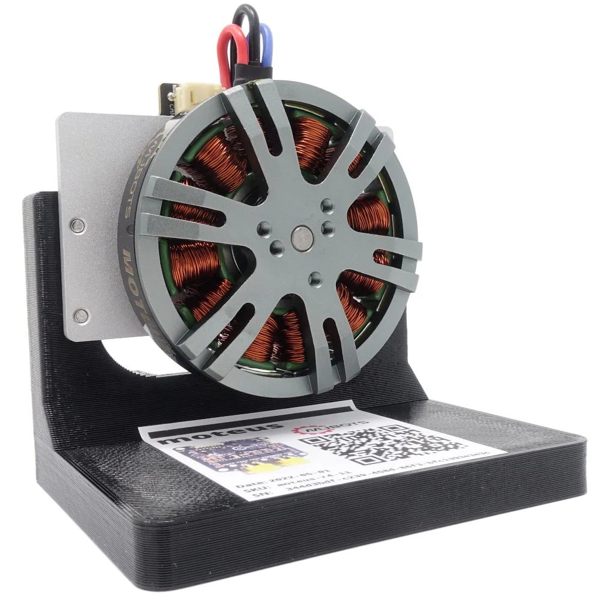

## GitHub Portfolio
I'm Artyom Boyarov, a hard-working, curious, and well-rounded student at the University of Michigan. I am majoring in Robotics with a minor in Electrical Engineering. My interests lie in Robotics, Computer Hardware, Nanotechnology, and Graphics. I hope you enjoy my portfolio!

# Projects
<!-- <i>Follow the link to each repository, where you'll find code, in-depth descriptions, pictures, videos, and more.</i>-->
<!--Can add FANUC SURCAR photos-->
<table>
  <tr align="center">
    <td width=500>
      <a href="https://github.com/artyom-boyarov/artyom-boyarov/blob/main/ROB_498_Final_Report.pdf">Learning Block Pushing Task Dynamics</a>   (Apr. 2025)  
      <i>Python, PyBullet, PyTorch, MPPI</i>
    </td>
    <td width=500>
      <a href="https://github.com/artyom-boyarov/artyom-boyarov/blob/main/ROB_490_W25_Final_Report.pdf">ML for Correcting Robotic Screw Fastening Misalignment</a>   (Jan. - Apr. 2025)  
      <i> Python, C++, Drake, PyTorch Neural Networks, KUKA Robots, Compliant Control </i>
    </td>
    <td width=500>
      <a href="https://github.com/artyom-boyarov/autonomous-parking-c">NL-MPC Autonomous Parking Path Planning</a>   (May - Aug. 2024)  
      <i>C++, CasADi, Nonlinear Optimization</i>
    </td>
  </tr>
  <tr>
    <td></td>
    <td></td>
    <td></td>
  </tr>
  <tr align="center">
    <td width=500><a href="https://doi.org/10.1115/MSEC2025-155431">Fragility-aware Grasping</a>  
      <a href="https://doi.org/10.1115/MSEC2025-155431">[paper]</a>  
      <i>Python, C++, Grasping, Flexiv robots</i>
    </td>
    <td width=500><a href="https://github.com/umrover/mrover-ros">MRover</a>: Embedded Software  
    <i>C++, ROS2, Brushless Motors, CAN</i>
    </td>
    <td width=500><a href="https://github.com/artyom-boyarov/fpga-demos">fpga-demos</a>: SystemVerilog HDL demos for the Basys3's on-board peripherals  
      <i>SystemVerilog, AMD Vivado</i>
    </td> 
  </tr>
  <tr>
    <td></td>
    <td></td>
    <td></td>
  </tr>
</table>
Additional research experience, internships, and coursework can be founded on my <a href="https://www.linkedin.com/in/artyom-art-boyarov-193568223/">LinkedIn page</a>.

# Technical skills
<table >
  <tr  align="center">
    <th width="500">Programming Languages</th>
    <th width="500">Hardware</th>
  </tr>
  <tr  align="center">
    <td >
      <i>C++, C, Python, MATLAB, Java, SystemVerilog</i>
    </td>
    <td >
      <i>Raspberry Pi, Arduino, ESP32, STM32</i> 
      <i>AMD/Intel FPGAs</i> 
      <i>FANUC CRX robots, KUKA iiwa robots</i>
    </td>
  </tr>
  <tr  align="center">
    <th>Tools</th>
    <th>Software Frameworks</th>
  </tr>
  
  <tr  align="center">
    <td>
      <i>Matlab, Simulink, SolidWorks, Altium Designer, AMD Vivado</i> </td>
    <td> 
      <i>ROS1/2, Qt, Matplotlib, Numpy, Drake, PyTorch, PyBullet, Stable-Baselines3, FANUC RMI
    </td>
  </tr>
</table>

<!--
Not everything I do can be published, but here is a description of other work I've done as part of internships and coursework:
- Software Engineering internship at Flex Technologies [London, UK, May-Aug 2023]:
  - Integrated new payment gateway (PaySera) with the company’s online Shopify store which reduced card payment processing cost by 50%. 
  - Developed Python software to automatically rectify orders entered incorrectly into courier’s IT system; saved 5 failed orders monthly.
  - Learned and developed a Google Apps Script which cut the time required to update store prices during a sale by 2 hours.
  - Developed a Python script to synchronize inventory levels on the company website with those of wholesale suppliers. Saved employees up to 1 hour of work per day and enhanced company reputation with accurate live inventory data.
  - Configured Ubuntu Linux servers to run integrations. Automated tasks using `cron` and `systemd`.
- <a href="https://cs61c.org/">CS61C<a>: Great Ideas in Computer Architecture (taken at UC Berkeley at age 16; achieved grade A): C-based text parser, RISC-V assembly MNIST classifier, RISC-V core built at the circuit level, and a Python extension for optimized linear algebra routines written in C.
- <a href="https://eecs280.org/">EECS 280</a>: Programming and Intro Data Structures (Fall 23 at U-M; grade A+): Image processing, Interactice Euchre game, Natural Language processing and Bayesian Classification (all C++).

<!--
# Coursework

<table>
  <tr align="center">
    <th width="500">Computer Science</th>
    <th width="500">Mathematics</th>
  </tr>
  <tr align="center">
    <td>
      EECS 280: Programming and Intro Data Structures 
      CS 61C: Great Ideas in Computer Architecture 
      EECS 215: Electronic Circuits 
      Introduction to Self-Driving Cars. 
      Web Development and Database Development using Python. 
    </td>
    <td>
      ROB 101: Linear Algebra for Robotics 
      MATH 215: Multivariable Calculus 
      MATH 216: Differential Equations 
      EECS 203: Discrete Math 
      Differential Equations 
    </td>
  </tr>
</table>

# Foreign Languages
I know German and Mandarin Chinese, both at a professional proficiency.
!-->
# Contact:
Feel free to reach out to ask more questions about my work or experience. Please email if you would like a copy of my resumé.  
Email: aboyarov _at_ umich _dot_ edu
